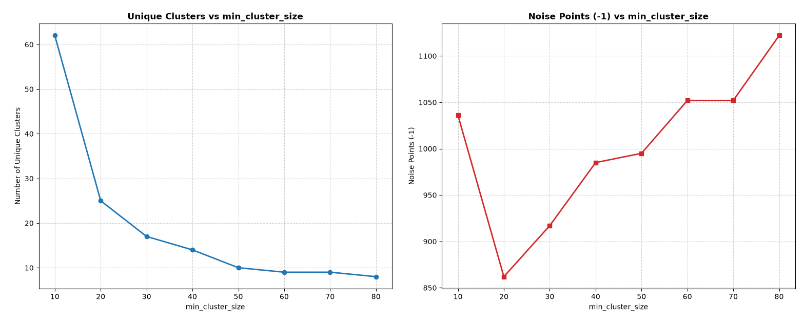
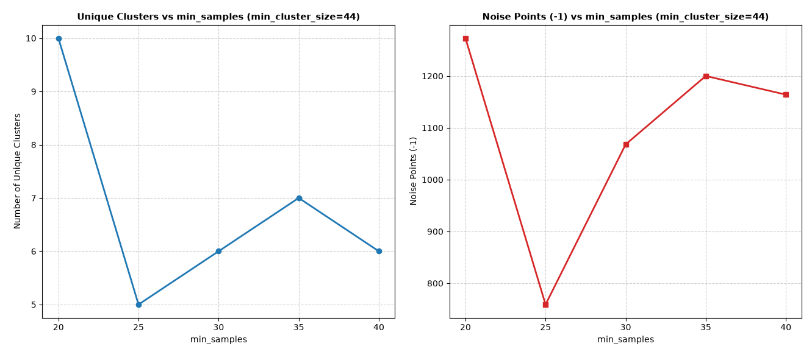

In this section, we go further to take a step toward clustering the groups together—or in technical terms, dense concentrations of points separated by sparse empty space.

## Default parameters used

* `min_cluster_size=10`
* `min_samples=3`
* `metric="euclidean"`
* `min_cluster_size`: The minimum number of points required to form a cluster.
* `min_samples` and `metric`: Used to calculate density and distance.

---

## 1. Tuning `min_cluster_size`

We make the following changes to the code, running a loop on cluster size to print out more information—first viewing the noise points with fixed `min_samples`:

```python
for i in range (1,9):
# Step 2: Fine-tune min_cluster_size and min_samples.
    cluster = hdbscan.HDBSCAN(
        min_cluster_size=i*10,
        min_samples=3,
        metric="euclidean",
    ) 
....
   if -1 in unique_clusters:
        counts = Counter(cluster_labels) 
        print(f"Noise points (-1): {counts.get(-1, 0)}")
        #print(f"size of clean cluster: {[counts[cluster] for cluster in unique_clusters]}")  
        unique_clusters.remove(-1)

```

### Output (Looping `min_cluster_size` with fixed `min_samples=3`)

| `min_cluster_size` | Noise points (`-1`) | Number of unique clusters |
| :--- | :--- | :--- |
| **10** | 1036 | 62 |
| **20** | 862 | 25 |
| **30** | 917 | 17 |
| **40** | 985 | 14 |
| **50** | 995 | 10 |
| **60** | 1052 | 9 |
| **70** | 1052 | 9 |
| **80** | 1122 | 8 |

### Graph

<p align="center">
  
</p>

### Analysis

In the graph, we look for the combination of cluster size and noise. For example, when `min_cluster_size` is 20, it gives the minimum noise points, but the number of unique clusters is too large and decreases in subsequent steps. For practical needs, we prefer a reasonable cluster size over noise. Since the cluster size is steady when `min_cluster_size` is between 40 and 50 and the noise increases within that same range, we then run the loop again with a smaller step; 44 seems to be a good number.

---

## 2. Tuning `min_samples`

Once we settle on `min_cluster_size=44`, we perform a loop on `min_samples`.

### Output (Looping `min_samples` with fixed `min_cluster_size=44`)

| `min_samples` | Noise points (`-1`) | Number of unique clusters | Size of clean clusters |
| :--- | :--- | :--- | :--- |
| **20** | 1273 | 10 | [66, 422, 49, 54, 134, 221, 110, 104, 74, 201, 1273] |
| **25** | 759 | 5 | [324, 64, 910, 398, 253, 759] |
| **30** | 1068 | 6 | [57, 391, 265, 301, 109, 517, 1068] |
| **35** | 1200 | 7 | [48, 380, 231, 49, 200, 109, 491, 1200] |
| **40** | 1164 | 6 | [442, 47, 205, 227, 111, 512, 1164] |

### Graph

<p align="center">
  
</p>

### Analysis

Notice that between 30 and 40 `min_samples`, there is a turning point when `min_samples` is 35, where the number of unique clusters is 7—the same as the number of classes in the core data.