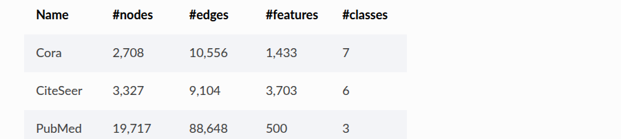

# Investigating Cora with UMAP and HDBSCAN

This guide demonstrates basic parameter tuning and dataset investigation. We use two libraries: **UMAP** and **HDBSCAN**. We will manipulate parameters from both UMAP and HDBSCAN to find the ideal clusters.

---

## Dataset: Cora

* **Source:** [PyTorch Geometric Planetoid Dataset](https://pytorch-geometric.readthedocs.io/en/2.6.0/generated/torch_geometric.datasets.Planetoid.html#torch_geometric.datasets.Planetoid)
* **Goal:** Reduce the node feature dimension of the Cora dataset from 2,708 × 1,433 to 2,708 × lower dimension.

---

## UMAP

Conceptually, think of UMAP as grouping points with similar features based on the distance formula defined by `metric`. 

* `n_neighbors`: Controls how many neighboring points are considered.
* `min_dist`: Controls how tightly packed the groups are (`min_dist=0.0` creates very tight groups with high density).

Default parameters used:

* `n_neighbors=5`
* `min_dist=0.0`
* `n_components=5`
* `metric="cosine"`
* `random_state=42`

---

## HDBSCAN

HDBSCAN is a clustering library that attempts to form clusters from the groups produced by the reducer.

* `min_cluster_size`: The minimum number of points required to form a cluster.
* `min_samples` and `metric`: Used to calculate density and distance.

You can think of these clusters as similar to star clusters: dense concentrations of points separated by sparse empty space.

Default parameters used:

* `min_cluster_size=10`
* `min_samples=3`
* `metric="euclidean"`

our goal is to show the step to find the ideal parameters (7 classes in data set).

---

## Fine-Tuning UMAP

We fine-tune UMAP first because HDBSCAN clustering directly depends on the input representation. If the ouput is overly fragmented, HDBSCAN cannot find meaningful macro-clusters.

UMAP is very sensitive to `n_components` and `n_neighbors`:

| Dimension (`n_components`) | Neighborhood Size (`n_neighbors`) | Clusters Found | Distance from Target (Goal: 7) | Trend / Takeaway |
| :---: | :---: | :---: | :---: | :--- |
| **5** | 5 | 99 | +92 | Highly fragmented; neighborhood is too local |
| **4** | 5 | 97 | +90 | Minimal change from component reduction alone |
| **4** | 20 | 72 | +65 | Higher neighbors start merging micro-clusters |
| **3** | 5 | 96 | +89 | Dimension drop alone does not fix fragmentation |
| **3** | 20 | 71 | +64 | Consistent with `n_components=4` |
| **3** | 40 | 63 | +56 | Wider manifold smoothing |
| **3** | 50 | **52** | **+45** | **Best observed:** captures broader global structure |

Increasing `n_neighbors` forces UMAP to preserve broader global structure rather than splitting points into micro-islands. We will explain more in the next section on fine-tuning HDBSCAN.

---

## Downstream Integration

The following is the parameter of the cora dataset (our goal).

  

After finding the optimal low-dimensional manifold using UMAP and extracting cluster labels via HDBSCAN, these dense representations.